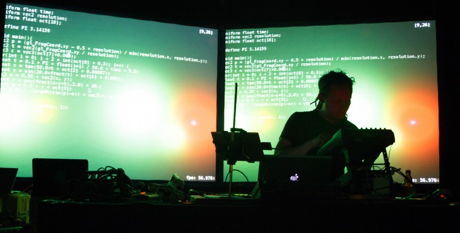
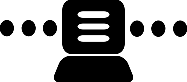
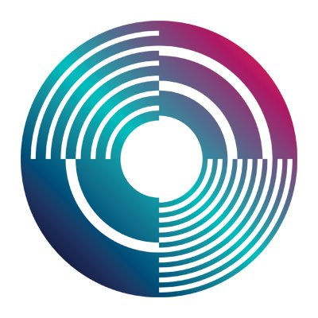
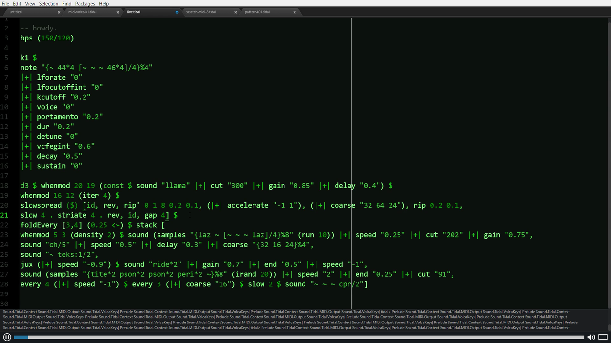
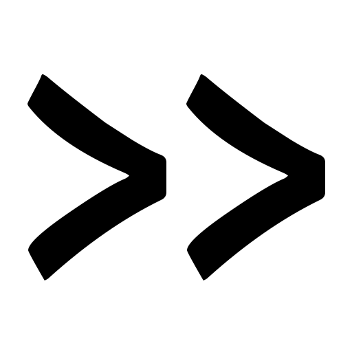

# Introduzione al live coding

## Live coding

<section>
	
Scrittura di codice dal vivo

</section>

>Live coding is a new direction in electronic music and video, and is getting somewhere interesting. Live coders expose and rewire the innards of software while it generates improvised music and/or visuals. All code manipulation is projected for your pleasure.

toplap.org

> Live coding works across musical genres, and has been seen in concert halls, late night jazz bars, as well as algoraves. There is also a strong movement of video-based live coders, writing code to make visuals, and many environments can do both sound and video, creating synaesthetic experiences.

toplap.org

>The community is diverse and seeks to engage in a wide cross-section of artistic practices including but not limited to music, audiovisual creation, performance, robotics, dance, scientific research and education.

ICLC 2019

>Live coding is inclusive and accessible to all.

toplap.org

>Live coding is primarily developed inside the **free culture movement**, and **encourages self creativity rather than cultural consumption.** Also diversity inclusion and respect has always been considered a fundamental part of the thinking around this practice in live coding communities.

ICLC 2019

## Il live coding
<section>

non è un genere musicale

è una tecnica compositiva e performativa

è utilizzato in diverse pratiche artistiche e creative

 è caratterizzato da inclusività apertura accessibilità

 si basa sui concetti di free culture e creazione di cultura piuttosto che su un suo consumo passivo

</section>

## TOPLAP

#### Temporary Organisation for the Promotion of Live Algorithm Programming

### Alcuni esempi

<iframe width="1200" height="630" src="https://www.youtube.com/embed/fIuqDKzYBzc" frameborder="0" allow="accelerometer; autoplay; encrypted-media; gyroscope; picture-in-picture" allowfullscreen></iframe>

<iframe width="1200" height="630" src="https://www.youtube.com/embed/0Vh7xLZRI78" frameborder="0" allow="accelerometer; autoplay; encrypted-media; gyroscope; picture-in-picture" allowfullscreen></iframe>

<iframe width="1200" height="630" src="https://www.youtube.com/embed/JY8eNSu6HrU" frameborder="0" allow="accelerometer; autoplay; encrypted-media; gyroscope; picture-in-picture" allowfullscreen></iframe>

<iframe width="1200" height="630" src="https://www.youtube.com/embed/hoV01_P6PGw" frameborder="0" allow="accelerometer; autoplay; encrypted-media; gyroscope; picture-in-picture" allowfullscreen></iframe>

<iframe width="1200" height="630" src="https://www.youtube.com/embed/0rg5GGFaIY0" frameborder="0" allow="accelerometer; autoplay; encrypted-media; gyroscope; picture-in-picture" allowfullscreen></iframe>

<!-- .slide: data-background-image="images/algorave-logo-big.png" data-background-size="50%" -->
>Algorave is made from “sounds wholly or predominantly characterised by the emission of a succession of repetitive conditionals“.

>Algorave musicians don’t pretend their software is being creative, they take responsibility for the music they make, shaping it using whatever means they have

# SuperCollider

Piattaforma per la sintesi audio e la composizione algoritmica.

E' usato da musicisti, artisti e ricercatori che la vorano con il suono.

# Tidalcycles

TidalCycles ('tidal') è free/open source software, che permette la creazione di pattern attraverso la scrittura di codice.

E' usato sia per il live coding che per la composizione in studio.

E' un'interfaccia di programmazione di SuperCollider

# FoxDot

E' una libreria Python per il live coding. E' stata creata per semplificare l'approccio al live coding pre chi non è pratico di programmazione

